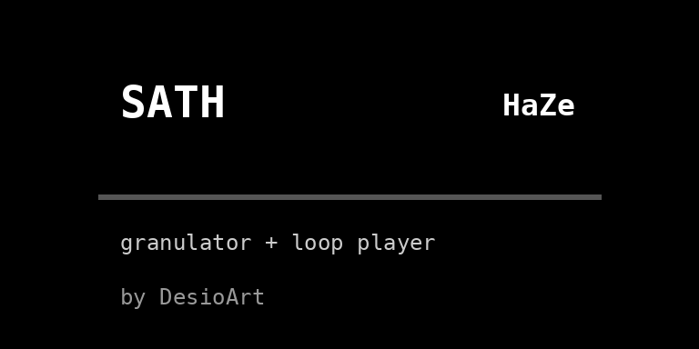
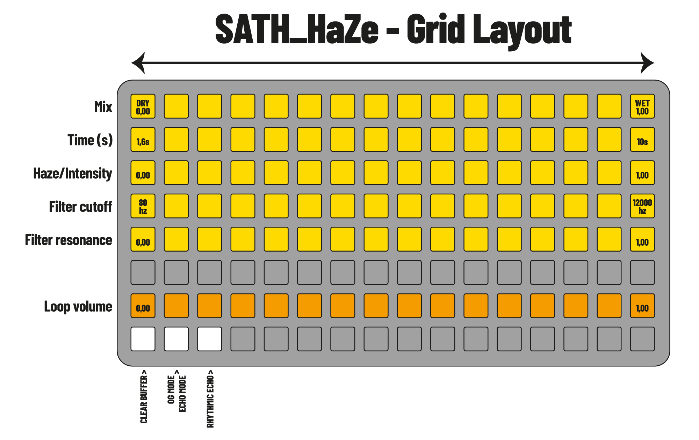

# SATH HAZE 🌫️

**generative composer / granulator + loop player with audio-reactive visuals.**

*sath haze is a generative live-processing tool inspired by the GC Haze (Glitch Cloud Audio) pedal. it captures whatever you play into a short loop and lets it evolve on its own over time — random position jumps, a resonant filter, and an optional rhythmic echo layer — instead of behaving like a standard record/play looper.*

*the script features a reactive fog animation that thickens and thins with the input signal, full grid/launchpad integration (tested with two Launchpad Mini MK3 via the midigrid mod), and a three-screen UI that also makes it usable without any grid at all.*

This script was developed with the assistance of Claude (Anthropic) as a collaborative coding tool.

---

## Splash screen



## Requirements

- norns
- audio input
- grid (optional, highly recommended) — tested with two Launchpad Mini MK3 combined into a single 16x8 grid via the midigrid mod (SYSTEM > MODS, size 128)

---

## Installation

**via maiden:**
```
;install https://github.com/DesioArt/sath-haze
```

**manual installation:**
- connect to norns via SFTP (we/sleep)
- navigate to `/home/we/dust/code/`
- create folder `sath_haze`
- upload `SATH_HaZe.lua` into that folder
- create folder `/home/we/dust/audio/sath_haze/` and place any samples you want to load (e.g. a worn-out vinyl recording) inside
- restart norns or SYSTEM > RESTART

---

## Documentation

### Norns Controls

**Key controls:**
- `K1` (hold ~0.6s) — cycle through the three screens: FOG → PARAMS → LOOP
- `K2` / `K3` — context-sensitive, depending on the active screen (see below)
- `E1` / `E2` — context-sensitive, depending on the active screen

**Screen 1 — FOG:**
- audio-reactive fog animation, no readable parameters (use the grid, or switch to PARAMS)
- `K2` — remove the loaded sample
- `K3` — load a sample from `dust/audio/`

**Screen 2 — PARAMS:**
- `E1` — select a parameter (mix, time, haze, filter cutoff, filter res, mode, echo)
- `E2` — adjust the selected parameter
- `K3` — clear buffer (removes accumulated noise from the main loop region without touching the loaded sample)

**Screen 3 — LOOP:**
- shows the currently loaded sample and its volume
- `E1` — adjust sample volume
- `K2` — remove the loaded sample
- `K3` — load a sample from `dust/audio/`

---

### Grid Layout



the grid provides hands-on control over every parameter, laid out as a 16x8 grid (two Launchpad Mini MK3 side by side via the midigrid mod).

**Row 1: mix (dry/wet)**
- lit columns = current level, left to right

**Row 2: time (loop length)**
- range 1.6s to 10s

**Row 3: haze / intensity**
- how much chaos: probability and amplitude of random position jumps in the buffer
- graduated response — low settings are subtle, only the top of the row gets genuinely glitchy

**Row 4: filter cutoff**
- logarithmic scale (matches how the ear perceives pitch), range 80Hz–12000Hz

**Row 5: filter resonance**

**Row 7: vinyl / texture layer volume**
- controls the loaded sample's level independently from the main signal

**Row 8:**
- **pad 1** — clear buffer (dim when idle, flashes on press)
- **pad 2** — toggle OG mode / Echo mode (two different overdub behaviors: soft accumulation vs. fast-decaying feedback)
- **pad 3** — toggle the rhythmic echo layer on/off

---

## Features

**Audio-reactive fog animation**
- wavy bands thicken and multiply as the input signal gets louder, thin out gradually when it stops
- each band has its own fixed random offset (position, phase, frequency) for a natural, staggered look instead of parallel lines
- particles fade in and out over the fog, more frequent with a stronger signal
- optional negative (inverted) look: white background, dark bands

**Generative drift**
- no pitch/rate wobble (removed — it produced an unwanted detuning effect)
- random position jumps only, with probability and amplitude that scale gradually with the haze parameter

**Logarithmic filter**
- cutoff mapped on a log scale for even perceptual steps across the row
- resonance boosts the output level automatically to compensate for the volume loss a resonant filter usually causes

**Two overdub modes**
- OG mode: soft accumulation, old material decays slowly
- Echo mode: fast decay, closer to a delay that empties out with each repeat

**Rhythmic echo layer**
- a dedicated softcut voice loops the same live input at 1/3 of the main loop length, creating subdivided rhythmic repeats
- lives in its own buffer region, independent from the main loop and the vinyl layer

**Loadable texture layer**
- load any sample (e.g. a worn vinyl recording) from `dust/audio/` and blend it under the main signal
- lives in a separate buffer region so it's never overwritten by the live recording

**Targeted buffer clearing**
- clears only the small region actually used by the main loop, not the entire buffer — much faster, and doesn't disturb the loaded sample or the echo layer

**Three-screen UI**
- FOG: the animated visual, for performance
- PARAMS: every parameter in plain text, selectable and adjustable with the encoders — makes the script fully usable without a grid
- LOOP: sample management and volume

---

## Tips & Tricks

**Building density gradually:**
start with haze at zero and mix low, then slowly raise both together — the transition from a clean loop to full glitch is designed to feel gradual, not abrupt.

**Layering the echo:**
toggle the rhythmic echo layer (grid row 8, pad 3) under a slow, sparse main loop for a call-and-response texture between the two.

**Vinyl as glue:**
a quiet, constant texture layer (row 7, low volume) can help mask the seams of the generative loop and give the whole thing a more cohesive, "one continuous piece" feel.

**Performance without a grid:**
hold K1 to reach the PARAMS screen and drive the entire instrument from just the norns' own encoders and keys — handy for quick sessions or when travelling light.

---

## Credits

created by [DesioArt](https://github.com/DesioArt)
built for [monome norns](https://monome.org/norns)
inspired by the GC Haze (Glitch Cloud Audio) pedal

---

## License

MIT
